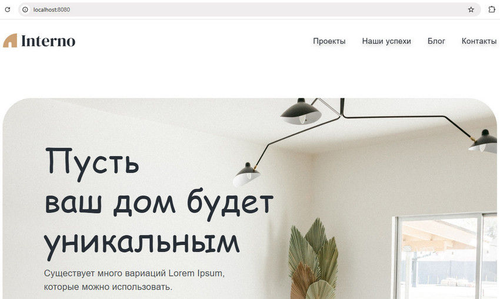
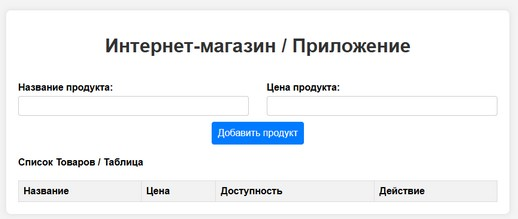
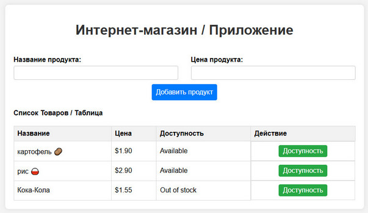

# Фреймворк Vue.js. Обучение в записи

# Урок 10. Семинар: Встроенные директивы и работа с данными компонента
## Часть 1: Работа с макетом

Продолжаем работу с макетом: Создайте компоненты шапки и подвала, чтобы можно было подключать их к новым страницам.

<br>

#### Задание по работе с макетом направлено на подготовку проекта к итоговой аттестации.

<br>
<br>

## Часть 2. Задание по Vue

Вы разрабатываете приложение для интернет-магазина и у вас есть компонент Vue под названием "ProductDetails". <br>Компонент отображает детали о конкретном продукте, включая его название, цену и статус доступности.<br>

Внутри компонента "ProductDetails" создайте свойство "product" с объектом, представляющим информацию о продукте.<br> Объект должен иметь свойства "name" (название продукта), "price" (цена продукта)<br> и "available" (флаг, указывающий на доступность продукта).<br>

Используя вычисляемое свойство, назовите его "formattedPrice", <br>которое будет возвращать форматированную цену продукта со знаком валюты.<br> Например, если цена равна 99.99, <br>вычисляемое свойство должно вернуть строку "$99.99".<br>

В компоненте "ProductDetails" отобразите название продукта,<br> его форматированную цену и статус доступности.<br>

Если продукт доступен, отобразите текст "Available",<br> в противном случае - "Out of stock".
<br>
<br>

#### Формат сдачи: ссылка на гитхаб.

<br>
<br>

### Решение задания

<br><br>

#### Задача 1

1. Запуск проекта из консоли командой:
```
npm run serve
```

2. Проект должен открываться в браузере по ссылке - Local:   http://localhost:8080/
```
http://localhost:8080/
```



<br><br>

#### Задача 2

Для решения задачи возможно сверстать файл html, указав стили и прикрепив в header ссылку на версию 2 для Vue.js.



Верстка состоит из стилей и тэга с id="app" после открывающегося тэга <body>
```
<div id="app">
        <product-details></product-details>
    </div>
```
Перед закрывающим тэгом </body> размещаем код Vue.js внутри тэга <script></script>
```

Vue.component('product-details', {
            template: ``
            , data(){
            },
             methods: {
             }
             });
             new Vue({
            el: '#app'
            });
            
```

1. **new Vue({ el: '#app' })** - создает экземпляр Vue и передает его в код в элемент с #app для работы приложения.
2. **Vue.component('product-details', {...})** - определяет компонент приложения product-details для Vue.js, <br> 
который содержит имеющуюся разметку страницы и создает логику js для управления товарами. <br>
3. **template: \...``** - шаблон компонента html. <br>
4. **data()** - приватное хранилище компонента, в котором можно хранить любые данные для вычислений, в данном случае возвращает объект с данными: newProduct – модель для нового продукта (название, цена, доступность) и 
products – массив добавленных товаров. <br>
5. **methods: {...}** - функция, вычислений компонента, которая добавляет новый товар в список addProduct(), <br> 
проверяя корректность данных, переключает доступность товара toggleAvailability(index), <br> 
преобразует данные цены в формате числа валюты formattedPrice(price). <br> <br>


Для необходимых параметров указать компоненты Vue.js к элементам верстки.




<br><br><br><br>
